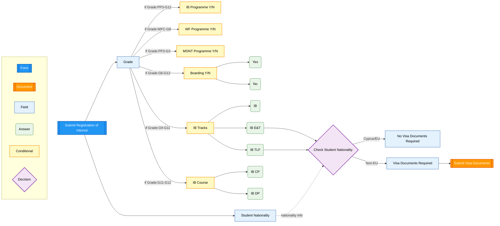
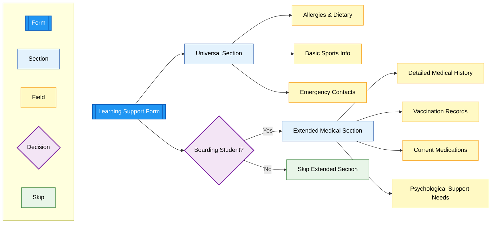
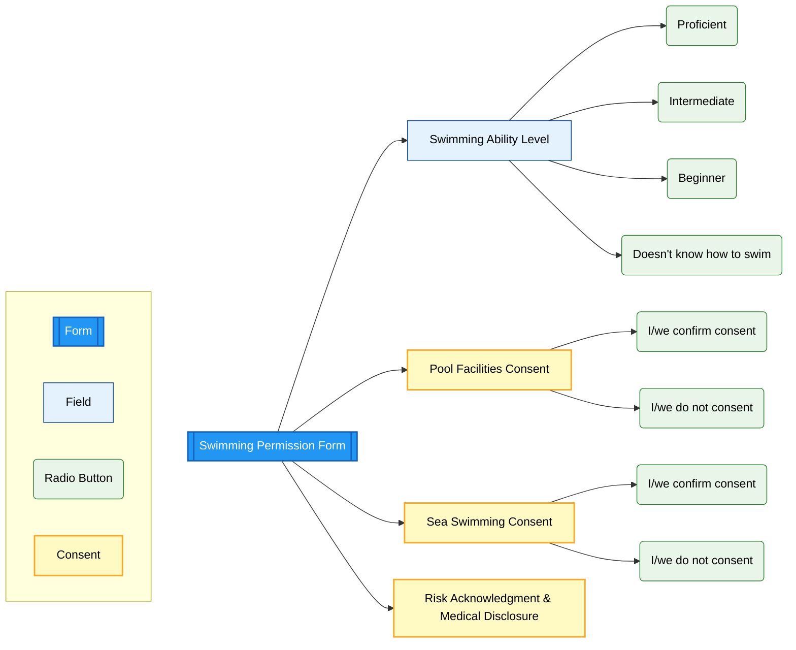
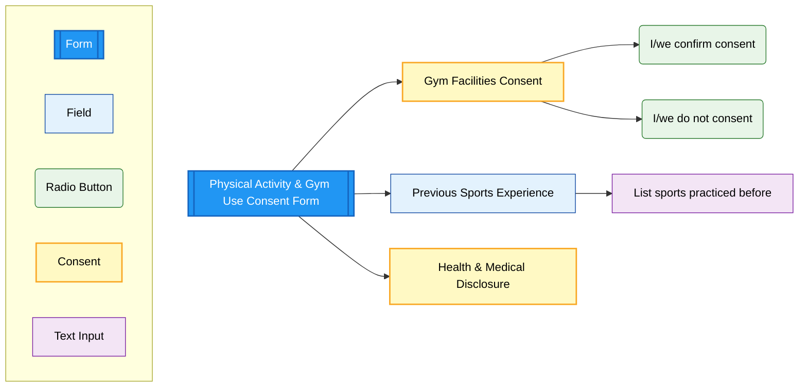

# OpenApply Complete Checklist and Forms - TLF & E&T Programmes

## Current Admission Process for TLF & E&T Programmes

### Sequential Checklist Items

- ROI form: "Submit Registration of Interest" // form
- LS form: "Submit Form for Learning Support (IB: Technology Leaders Scholarship)" // form
- Swimming form: "Submit Swimming Permission Form" // form (boarding only) 
- Physical activity form: "Submit Physical Activity & Gym Use Consent Form" // form (boarding only)
- Visa documents: "Submit Visa Documents" // document submission (E&T/TLF non-EU citizens only)
- Personal references: "Upload two personal references from teachers/tutors" // document submission
- Video: "Upload a video introduction about the applicant's motivation (2-5 minutes)" // form
- Proof of achievements: "Upload proof of achievements" // document submission
- Portfolio: "Upload Portfolio with personal projects" // document submission
- Wait for response: "Receive an email with the next steps" // to do

### Current Process Flow

```mermaid
flowchart LR
  %% ===== LEGEND =====
  subgraph Legend[" "]
    direction LR
    LegendForm[["Form"]]:::form
    LegendDocument[["Document Submission"]]:::document
    LegendTodo[["To-Do Item"]]:::todo
    LegendStart([Start/End]):::start
    LegendEndpoint([Endpoint]):::endpoint
  end
  Legend ~~~ Start

  %% ===== START =====
  Start([Application Process Start]):::start
  
  %% ===== MAIN CHECKLIST ITEM =====
  ROI[["Submit Registration of Interest"]]:::form
  
  %% ===== SUBSEQUENT CHECKLIST ITEMS =====
  subgraph AfterROI[" "]
    direction LR
    LS[["Submit Form for Learning Support<br/>IB: Technology Leaders Scholarship"]]:::form
    References[["Upload two personal references<br/>from teachers/tutors"]]:::document
    Video[["Upload a video introduction about<br/>the applicant's motivation (2-5 minutes)"]]:::form
    Achievements[["Upload proof of achievements"]]:::document
    Portfolio[["Upload Portfolio with<br/>personal projects"]]:::document
    Wait[["Receive an email with<br/>the next steps"]]:::todo
    
    LS ~~~ References ~~~ Video ~~~ Achievements ~~~ Portfolio ~~~ Wait
  end
  
  %% ===== BOARDING-SPECIFIC FORMS =====
  subgraph BoardingForms["Boarding Students Only"]
    direction LR
    Swimming[["Submit Swimming Permission Form"]]:::form
    Physical[["Submit Physical Activity & Gym Use Consent Form"]]:::form
    
    Swimming ~~~ Physical
  end
  
  %% ===== VISA DOCUMENTS =====
  subgraph VisaDocs["E&T/TLF Non-EU Citizens Only"]
    direction TB
    VisaSubmission[["Submit Visa Documents"]]:::document
    
    VisaSubmission --> CriminalCheck[Criminal Background Check]:::field
    VisaSubmission --> HealthInsurance[Health Insurance Certificate]:::field
    VisaSubmission --> SponsorLetter[Sponsor Letter]:::field
    VisaSubmission --> StudentVisa[Student Visa Application]:::field
    VisaSubmission --> FinancialProof[Financial Support Documentation]:::field
  end
  
  %% ===== FLOW =====
  Start --> ROI
  ROI --> AfterROI
  ROI --> |if Boarding = Yes| BoardingForms
  ROI --> |if E&T/TLF + Non-EU| VisaDocs
  
  %% ===== END POINT =====
  AfterROI --> End([Awaiting School Response]):::endpoint
  BoardingForms --> End
  VisaDocs --> End
  
  %% ===== STYLING =====
  classDef start fill:#4CAF50,stroke:#2E7D32,stroke-width:3px,color:#fff;
  classDef form fill:#2196F3,stroke:#1565C0,stroke-width:2px,color:#fff;
  classDef document fill:#FF9800,stroke:#E65100,stroke-width:2px,color:#fff;
  classDef todo fill:#9C27B0,stroke:#6A1B9A,stroke-width:2px,color:#fff;
  classDef link fill:#9C27B0,stroke:#6A1B9A,stroke-width:2px,color:#fff;
  classDef field fill:#fff9c4,stroke:#f9a825,stroke-width:1px,color:#000;
  classDef endpoint fill:#F44336,stroke:#B71C1C,stroke-width:3px,color:#fff;
```

### Item Type Legend

| Type | Description | Visual Style |
|------|-------------|--------------|
| **form** | Interactive form to be completed in OpenApply | Blue |
| **document submission** | File upload requirement | Orange |
| **to do** | Action item or waiting status | Purple |

### Process Notes

- This represents the current flow in OpenApply
- Items appear simultaneously after ROI submission  
- No conditional logic is currently implemented
- The process is the same regardless of boarding status or nationality
- Future iterations will add conditional branching based on Registration of Interest responses

### Implementation Status

#### Current State
- **Simple Linear Flow**: All items appear after ROI submission
- **No Conditional Logic**: Same process for all programme types
- **Manual Processing**: School reviews applications individually

#### Future Enhancements
- **Conditional Checklist Items**: Based on programme selection and boarding status
- **Automated Routing**: Different flows for TLF vs E&T programmes
- **Dynamic Requirements**: Visa documents only for non-EU boarding students

---

# Registration of Interest Form

## Field Visibility Rules

### Grade Selection
**Always visible** - Determines which programme fields appear

### Citizenship
**Always visible** - Multiple choice field with all world countries
- **EU citizens:** No additional requirements
- **Non-EU citizens:** Visa documents required

### IB Programme Y/N
**Visible for grades:** PP3, PP4, PP5, G1, G2, G3, G4, G5, G6, G7, G8, G9, G10, G11, G12

### WF Programme Y/N  
**Visible for grades:** Waldorf Family Club/Pareklisia, PP3, PP4, PP5, G1, G2, G3, G4, G5, G6, G7, G8

### MONT Programme Y/N
**Visible for grades:** PP3, PP4, PP5, G1, G2, G3

### Boarding Y/N
**Visible for grades:** G6, G7, G8, G9, G10, G11, G12

### Visa Documents Required (collected in subsequent checklist items)
**Visible for:** Non-EU citizens only
**Condition:** Only if Citizenship ≠ EU country

### IB Tracks (Multiple Choice: IB / IB E&T / IB TLF)
**Visible for grades:** G9, G10, G11
**Condition:** Only if "IB Programme Y/N" = Yes

### IB Course (Multiple Choice: IB CP / IB DP)
**Visible for grades:** G11, G12  
**Condition:** Only if "IB Programme Y/N" = Yes

---

# Learning Support Form

## Form Structure

### Universal Section (All Students)

#### Allergies & Dietary Requirements
**Required section** - Essential health and safety information
- **Food allergies**: Specific allergens and severity levels
- **Environmental allergies**: Pollen, dust, animals, etc.
- **Dietary restrictions**: Religious, medical, or personal preferences
- **Emergency medication**: EpiPen, inhalers, or other emergency treatments
- **Severity levels**: Mild, moderate, severe reactions

#### Basic Sports Information
**Required section** - Physical activity participation
- **Sports participation consent**: General authorization for school sports
- **Physical limitations**: Any restrictions on activities
- **Previous injuries**: Relevant medical history affecting sports
- **Preferred activities**: Student interests and preferences
- **Medical clearance**: Health status for physical activities

#### Emergency Contacts
**Required section** - Critical contact information
- **Primary emergency contact**: Parent/guardian with full details
- **Secondary emergency contact**: Alternative family member or friend
- **Medical emergency contacts**: Family doctor, specialist physicians
- **Authorization for medical treatment**: Consent for emergency care
- **Pickup authorization**: Who can collect the student

### Extended Medical Section (Boarding Students Only)

#### Detailed Medical History
**Required for boarding** - Comprehensive health background
- **Chronic conditions**: Diabetes, asthma, epilepsy, etc.
- **Mental health history**: Depression, anxiety, ADHD, etc.
- **Surgical history**: Previous operations and recovery details
- **Family medical history**: Genetic conditions and hereditary risks
- **Growth and development**: Any developmental concerns

#### Vaccination Records
**Required for boarding** - Complete immunization status
- **Standard vaccinations**: MMR, DPT, Polio, etc.
- **COVID-19 vaccination**: Current status and booster records
- **Travel vaccinations**: Hepatitis, Yellow Fever, etc.
- **Tuberculosis screening**: TB test results and dates
- **Medical exemptions**: Religious or medical vaccination waivers

#### Current Medications
**Required for boarding** - Medication management
- **Prescription medications**: Current drugs, dosages, and schedules
- **Over-the-counter medications**: Regular supplements or treatments
- **Administration instructions**: How and when to give medications
- **Storage requirements**: Refrigeration, controlled substances, etc.
- **Emergency medications**: EpiPen, rescue inhalers, seizure medications

#### Psychological Support Needs
**Required for boarding** - Mental health and behavioral support
- **Learning differences**: Dyslexia, ADHD, autism spectrum, etc.
- **Behavioral concerns**: Social anxiety, depression, anger management
- **Support strategies**: Effective coping mechanisms and interventions
- **Professional support**: Therapists, counselors, psychiatrists
- **Trigger situations**: Known stressors or problematic scenarios

## Implementation Notes

### Conditional Logic
- **Universal sections** appear for all TLF and E&T students
- **Extended medical section** only appears when boarding is selected
- **Integration with ROI**: Boarding status from Registration of Interest determines form complexity

### Medical Consultation Required
**Questions for Anna (Learning Support Coordinator):**
1. Exact field breakdown for basic vs. extended medical sections
2. Required vs. optional fields in each section
3. Integration with existing medical record requirements
4. Vaccination record format and validation requirements
5. Medication administration protocols for boarding students
6. Emergency response procedures and contact protocols

### Data Protection & Privacy
- **GDPR compliance** for sensitive medical information
- **Access controls** limiting who can view medical details
- **Secure storage** of vaccination records and medical history
- **Parent consent** for sharing medical information with relevant staff

### Integration Points
- **School nurse** receives relevant medical information
- **Boarding staff** get essential emergency and medication details
- **Sports coordinators** access physical activity restrictions
- **Academic support** team receives learning difference information

---

# Swimming Permission Form

## Form Structure

### Swimming Ability Assessment
**Required field** - Multiple choice selection
- **Proficient**: Advanced swimming skills
- **Intermediate**: Basic swimming competency
- **Beginner**: Limited swimming ability
- **Doesn't know how to swim**: No swimming skills

### Pool Facilities Consent
**Required field** - Consent for swimming pool use
- Confirms parent authorization for pool activities
- Under boarding house staff supervision

### Sea Swimming Consent  
**Required field** - Consent for supervised sea activities
- Authorization for sea swimming under staff supervision
- Additional risk acknowledgment required

### Risk Acknowledgment
**Required field** - Legal disclaimer and medical disclosure
- Acknowledgment of inherent swimming risks
- Consent for participation under appropriate supervision
- Confirmation of medical condition disclosure
- Medical concerns affecting swimming safety

## Implementation Notes

### Boarding-Specific Form
- **Visible for**: Boarding students only
- **Condition**: Only appears if "Boarding Y/N" = Yes in ROI
- **Integration**: Part of boarding consent package

### Legal Compliance
- Digital signature capture required
- Risk acknowledgment with legal disclaimer
- Medical disclosure confirmation
- Parental consent documentation

---

# Physical Activity & Gym Use Consent Form

## Form Structure

### Gym Facilities Consent
**Required field** - Consent for gym facility access
- **I/we confirm consent**: Authorization for gym use
- **I/we do not consent**: Opt-out of gym activities
- Under boarding house staff supervision

### Previous Sports Experience
**Optional field** - Text input for sports background
- List sports child practiced before coming to Island School
- Helps staff understand student's athletic background
- Free text input field

### Health Confirmation & Medical Disclosure
**Required field** - Health status and medical information
- Confirmation that child is in good health
- Agreement to inform school of medical conditions
- Understanding of qualified staff supervision
- Acknowledgment of safe environment protocols

## Implementation Notes

### Boarding-Specific Form
- **Visible for**: Boarding students only
- **Condition**: Only appears if "Boarding Y/N" = Yes in ROI
- **Integration**: Part of boarding consent package

### Sports Program Integration
- **Background Information**: Collected for program planning
- **Medical Clearance**: Required for participation
- **Safety Protocols**: Staff supervision and safe environment
- **Risk Management**: Medical condition disclosure requirements

### Legal Compliance
- Digital signature capture required
- Health status confirmation
- Medical disclosure agreement
- Qualified supervision acknowledgment 