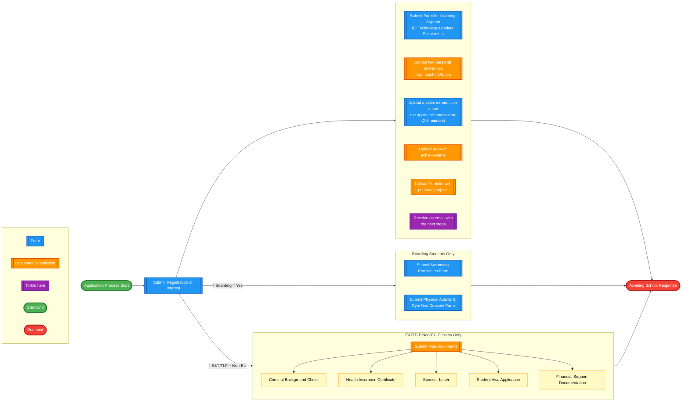

# OpenApply Checklist - Current Flow

> **Navigation:** [Main Checklist](checklist.md) | [ROI Form](forms/roi.md) | [Learning Support](forms/ls.md) | [Swimming Form](forms/swimming.md) | [Physical Activity](forms/physical.md) | [Extensions](extensions.md)

## Current Admission Process for TLF & E&T Programmes

### Sequential Checklist Items

- ROI form: "Submit Registration of Interest" // form
- LS form: "Submit Form for Learning Support (IB: Technology Leaders Scholarship)" // form
- Swimming form: "Submit Swimming Permission Form" // form (boarding only) 
- Physical activity form: "Submit Physical Activity & Gym Use Consent Form" // form (boarding only)
- Visa documents: "Submit Visa Documents" // document submission (E&T/TLF non-EU citizens only)
- Personal references: "Upload two personal references from teachers/tutors" // document submission
- Video: "Upload a video introduction about the applicant's motivation (2-5 minutes)" // form
- Proof of achievements: "Upload proof of achievements" // document submission
- Portfolio: "Upload Portfolio with personal projects" // document submission
- Wait for response: "Receive an email with the next steps" // to do

## Current Process Flow

## Item Type Legend

| Type | Description | Visual Style |
|------|-------------|--------------|
| **form** | Interactive form to be completed in OpenApply | Blue |
| **document submission** | File upload requirement | Orange |
| **to do** | Action item or waiting status | Purple |

## Process Notes

- This represents the current flow in OpenApply
- Items appear simultaneously after ROI submission  
- No conditional logic is currently implemented
- The process is the same regardless of boarding status or nationality
- Future iterations will add conditional branching based on Registration of Interest responses

## Implementation Status

### Current State
- **Simple Linear Flow**: All items appear after ROI submission
- **No Conditional Logic**: Same process for all programme types
- **Manual Processing**: School reviews applications individually

### Future Enhancements
- **Conditional Checklist Items**: Based on programme selection and boarding status
- **Automated Routing**: Different flows for TLF vs E&T programmes
- **Dynamic Requirements**: Visa documents only for non-EU boarding students

---

**Cross-References:**
- [ROI Form Details →](forms/roi.md) - Registration of Interest logic and conditions
- [Implementation Extensions →](Extensions.md) - Suggested enhancements and additional functionality 