# Current OpenApply Checklist Analysis

> **Navigation:** [Main Checklist](checklist.md) | [ROI Form](forms/roi.md) | [Learning Support](forms/ls.md) | [Swimming Form](forms/swimming.md) | [Physical Activity](forms/physical.md) | [Extensions](extensions.md)

## Current Checklist Flow Visualization


---

## Current Checklist Items (Correct Order 01-25)

### **Phase 1: Initial Application (Items 01-06)**

#### **01. Submit Registration of Interest**
- **Type**: Form
- **Statuses**: Pending, Admitted, Place offered, Wait-listed, Declined, Enrolled
- **Conditions**: `(HS Students 2024-2025 ≠ Yes) AND (REE 2025-2026 ≠ Yes)`
- **Form**: Registration of Interest
- **🔄 Integration**: **REPLACE** with TLF/E&T ROI form with conditional logic

#### **02. Book School Tour (Optional)**
- **Type**: To Do (Optional)
- **Statuses**: Pending, Admitted, Place offered
- **Conditions**: `(IB Tracks ≠ IB: Technology Leaders Sch) AND (IB Tracks ≠ IB: Entrepreneurship & Technology) AND (HS Students 2024-2025 ≠ Yes) AND (REE 2025-2026 ≠ Yes)`
- **Description**: Optional school tour booking via Calendly
- **🚫 Current Logic**: **EXCLUDES TLF & E&T** students
- **🔄 Integration**: **MODIFY** conditions to include TLF/E&T or create separate versions

#### **03. Submit Form for Learning Support (IB)**
- **Type**: Form
- **Statuses**: Pending, Admitted, Place offered
- **Conditions**: `(IB Programme ... = Yes) AND (IB Tracks ≠ IB: Technology Leaders Sch) AND (REE 2025-2026 ≠ Yes)`
- **Form**: Learning Support form (IB / Montessori)
- **🚫 Current Logic**: **EXCLUDES TLF** students
- **🔄 Integration**: **REPLACE** with TLF/E&T Learning Support form with boarding logic

#### **04. Book Time Slot for Aptitude and English Tests (IB)**
- **Type**: To Do
- **Statuses**: Pending, Admitted, Place offered
- **Conditions**: `(Dependency: Completed Submit Form for...) AND (IB Programme ... = Yes) AND (IB Tracks ≠ IB: Technology Leaders Sch)`
- **Description**: SimplyBook.it integration for test scheduling
- **🚫 Current Logic**: **EXCLUDES TLF** students
- **🔄 Integration**: **REMOVE** for TLF (scholarship doesn't require tests), **MODIFY** for E&T if needed

#### **05. Book Interview with IB Representative**
- **Type**: To Do
- **Statuses**: Pending, Admitted, Place offered
- **Conditions**: `(Dependency: Completed Submit Form for...) AND (IB Programme ... = Yes) AND (Enrollment Year = 2024-2025 Academic Year)`
- **Description**: SimplyBook.it integration for interview scheduling
- **🔄 Integration**: **MODIFY** conditions to include TLF/E&T with programme-specific logic

#### **06. Receive Decision from Admission Team**
- **Type**: To Do
- **Statuses**: Pending, Admitted, Place offered
- **Conditions**: `(Dependency: Completed Submit Form for... [ROI])`
- **Description**: Wait for admission decision email
- **✅ Integration**: **REUSE** without modification

---

### **Phase 2: Programme-Specific Forms (Items 3-7)**

#### **03** | Submit Learning Support Form (E&T/TLF) | Form | 🔄 **MODIFY** | Enhanced version with boarding sections |
#### **04** | Upload Two Personal References | Document | ➕ **ADD NEW** | E&T/TLF specific requirement |
#### **05** | Upload Video Introduction | Form/Document | ➕ **ADD NEW** | 2-5 minute motivation video |
#### **06** | Upload Proof of Achievements (Optional) | Document | ➕ **ADD NEW** | **OPTIONAL** - Olympiads, certificates, etc. |
#### **07** | Upload Portfolio with Projects (Optional) | Document | ➕ **ADD NEW** | **OPTIONAL** - Personal projects showcase |

---

### **Phase 3: Document Submissions (Items 13-20)**

#### **13. Submit Child's Birth Certificate**
- **Type**: Document Submission
- **Data Categories**: General, Legal, Medical
- **Statuses**: Pending, Admitted, Place offered, Enrolled
- **Conditions**: Standard post-admission conditions
- **✅ Integration**: **REUSE** without modification

#### **14. Submit Child's Passport or ID Card**
- **Type**: Document Submission
- **Data Categories**: General, Legal, Medical
- **Statuses**: Pending, Admitted, Place offered, Enrolled
- **Description**: For non-Cypriots: Passport only; For Cypriots: Passport or ID Card
- **✅ Integration**: **REUSE** without modification (satisfies visa requirements too)

#### **15. Submit Parents'/Guardians' Passports or ID Cards**
- **Type**: Document Submission
- **Data Categories**: General, Legal
- **Statuses**: Pending, Admitted, Place offered, Enrolled
- **Description**: All parents/guardians required; No residence permits accepted
- **✅ Integration**: **REUSE** without modification

#### **16. Submit Proof of Residence**
- **Type**: Document Submission
- **Data Categories**: General
- **Statuses**: Pending, Admitted, Place offered, Enrolled
- **Description**: Rental agreement or utility bill
- **✅ Integration**: **REUSE** without modification

#### **17. Submit Child's Health Certificate**
- **Type**: Document Submission
- **Data Categories**: General, Medical
- **Statuses**: Pending, Admitted, Place offered, Enrolled
- **Description**: Pediatrician note in Greek/English confirming school attendance
- **✅ Integration**: **REUSE** without modification

#### **18. Submit Vaccination Coverage Certificate or Vaccination Refusal**
- **Type**: Document Submission
- **Data Categories**: General, Medical
- **Statuses**: Admitted, Place offered, Enrolled
- **Description**: Vaccination certificate or signed refusal form
- **✅ Integration**: **REUSE** without modification

#### **19. Submit Medical Report**
- **Type**: Document Submission
- **Data Categories**: General, Medical
- **Statuses**: Admitted, Place offered, Enrolled
- **Conditions**: **ONLY IF** `Special Educational... = Yes`
- **Description**: Medical report confirming Special Educational Needs
- **✅ Integration**: **REUSE** without modification (conditional)

#### **20. Submit Student's Photo**
- **Type**: Document Submission
- **Data Categories**: General, Academic
- **Statuses**: Admitted, Place offered, Enrolled
- **Description**: Portrait photo (PNG/JPEG/GIF, min 300x300px)
- **✅ Integration**: **REUSE** without modification

---

### **Phase 4: Administrative & Final Steps (Items 21-25)**

#### **21. Receive Invoice from Accounting Team**
- **Type**: To Do
- **Statuses**: Admitted, Place offered, Enrolled
- **Conditions**: Post-admission trigger
- **✅ Integration**: **REUSE** without modification

#### **22. Receive Onboarding Email + First Day Date**
- **Type**: To Do
- **Statuses**: Admitted, Place offered, Enrolled
- **Conditions**: Post-enrolment trigger
- **✅ Integration**: **REUSE** without modification

#### **23. Submit Field Trip Authorisation Form (2024-2025)**
- **Type**: Form
- **Statuses**: Admitted, Place offered, Enrolled
- **Conditions**: Post-enrolment trigger
- **Form**: Field Trip Authorisation Form (2024-2025)
- **🔄 Integration**: **ENHANCE** with boarding-specific provisions

#### **24. Submit the School Bus: Walk Alone Consent Form (Optional)**
- **Type**: Form (Optional)
- **Statuses**: Admitted, Place offered, Enrolled
- **Conditions**: Post-enrolment trigger
- **Form**: School Bus: Walk Alone Consent Form
- **🔄 Integration**: **ENHANCE** with boarding-specific provisions

#### **25. Submit Unaccompanied Dismissal Permission (Optional)**
- **Type**: Form (Optional)
- **Statuses**: Admitted, Place offered, Enrolled
- **Description**: Allow child to leave without parental supervision
- **Form**: Unaccompanied Dismissal Permission Form (MYP)
- **🔄 Integration**: **ENHANCE** with boarding-specific provisions

### **Flow Analysis:**

#### **Critical Dependencies:**
1. **ROI Completion** → Opens Phase 1 (Items 02-03: School Tour + Learning Support)
2. **Learning Support Completion** → Opens Phase 2 (Items 04-06: Tests + Interview + Decision)
3. **Decision Completion** → Opens Phase 3 (Enrolment Forms 07-08 + Document Submissions 13-20)
4. **Enrolment Form Completion** → Opens Phase 4 (E-Signature workflow 09-12)
5. **2024-2025 E-Signature Completion** → Opens Phase 5 (Final forms 21-25, current year only)

#### **Conditional Logic Patterns:**
- **IB Programme = Yes**: Required for Learning Support, Aptitude Tests, Interview
- **IB Tracks Exclusions**: TLF excluded from School Tour, Learning Support, Aptitude Tests
- **Enrollment Year**: Affects which enrolment form appears
- **Special Educational Needs**: Conditionally shows Medical Report requirement

#### **Current Exclusion Issues for TLF/E&T:**
- Items 02, 03, 04 specifically exclude TLF students
- Item 08 excludes TLF students  
- School Tour excludes both TLF and E&T students

---

## Executive Summary

This document analyzes the current OpenApply checklist structure (25 items) and maps integration opportunities for the new **TLF (Technology Leaders of the Future)** and **E&T (Entrepreneurship & Technology)** programmes.

### Key Findings:
- **High Reusability**: 15+ items can be reused without modification
- **Critical Field**: `IB Tracks` field controls programme-specific visibility
- **Integration Points**: 6 items need TLF/E&T specific adaptations
- **Boarding Logic**: Several items already have boarding-specific conditions

---

## Integration Strategy: Current TLF/E&T Items

### **Current TLF/E&T Checklist Items (from checklist.md)**

| Current Item | Integration Strategy | Maps to Existing Item |
|--------------|---------------------|----------------------|
| Submit Registration of Interest | **REPLACE** Item 01 | ✅ Direct replacement |
| Submit Form for Learning Support | **REPLACE** Item 03 | ✅ Enhanced with boarding logic |
| Submit Swimming Permission Form | **ADD NEW** | ➕ New boarding-only item |
| Submit Physical Activity & Gym Use Consent | **ADD NEW** | ➕ New boarding-only item |
| Submit Visa Documents | **ADD NEW** | ➕ New conditional item for non-EU |
| Upload two personal references | **ADD NEW** | ➕ New document submission |
| Upload video introduction | **ADD NEW** | ➕ New form/document hybrid |
| Upload proof of achievements | **ADD NEW** | ➕ New document submission |
| Upload Portfolio with projects | **ADD NEW** | ➕ New document submission |
| Receive email with next steps | **MERGE** with Item 06 | ✅ Enhanced version |

---

## Reusability Analysis

### **✅ High Reusability (15 items)**
Items that can be used without modification for TLF/E&T:
- **Items 06, 09-22**: Administrative and document submission items
- **Benefit**: Avoid duplicate data collection, maintain consistency

### **🔄 Moderate Reusability (6 items)**
Items needing condition modifications for TLF/E&T:
- **Items 02, 03, 04, 05, 07, 08**: Programme-specific forms and processes
- **Strategy**: Update conditions to include/exclude TLF/E&T appropriately

### **➕ New Items Needed (6 items)**
Programme-specific items not in current checklist:
- Swimming Permission, Physical Activity forms (boarding)
- Visa Documents (non-EU students)
- Personal References, Video, Achievements, Portfolio

### **🚫 Current Exclusion Logic**
Several items specifically exclude TLF/E&T programmes:
- Item 02: School Tour
- Item 03: Learning Support  
- Item 04: Aptitude Tests
- Item 08: 2025-2026 Enrolment Form

---

## Implementation Recommendations

### **Phase 1: Immediate Integration**
1. **Update ROI form** (Item 01) with TLF/E&T conditional logic
2. **Modify Learning Support** (Item 03) with boarding enhancements
3. **Add new programme-specific items** as needed

### **Phase 2: Condition Updates**
1. **Review exclusion logic** for Items 02, 04, 08
2. **Update IB Tracks conditions** to properly include TLF/E&T
3. **Test conditional workflows** thoroughly

### **Phase 3: Enhancement**
1. **Add boarding-specific logic** to Items 23-25
2. **Integrate visa document requirements** with existing passport submissions
3. **Create programme-specific enrolment forms**

---

## Critical Implementation Notes

### **IB Tracks Field Values**
- Current: `IB: Technology Leaders Sch`, `IB: Entrepreneurship & Technology`
- **Ensure consistent naming** across all conditions
- **Test both inclusion and exclusion logic**

### **Boarding Logic Integration**
- Several existing items need boarding enhancements
- New boarding-only items (Swimming, Physical Activity) 
- **Coordinate with Head of Boarding** (starts July 1st)

### **Visa Document Optimization**
- Current passport/ID submissions can satisfy visa requirements
- **Avoid duplicate document collection**
- **Streamline for non-EU E&T/TLF students only**

---

**Last Updated**: Current as of checklist analysis
**Next Review**: After TLF/E&T integration testing 

---

## Optimal E&T/TLF Checklist Order Analysis

Based on the OpenApply screenshots and current implementation, here's the recommended checklist restructuring for E&T/TLF programmes:

### **Current E&T/TLF Implementation Issues**

From the screenshots, I can see that E&T/TLF items currently appear **after** all regular IB items (items 1-25), which creates several problems:

1. **All E&T/TLF items appear simultaneously** after ROI completion
2. **No logical progression** or dependency management
3. **Boarding-specific items** aren't properly conditional
4. **Visa documents** aren't integrated with existing document collection

### **Recommended E&T/TLF Checklist Order**

#### **Phase 1: Initial Application (Items 1-2)**
| Order | Item | Type | Action | Notes |
|-------|------|------|--------|-------|
| **01** | Submit Registration of Interest | Form | ✅ **KEEP** | Enhanced with E&T/TLF conditional logic |
| **02** | ~~Book School Tour~~ | Optional | ❌ **SKIP** | Currently excludes E&T/TLF anyway |

#### **Phase 2: Programme-Specific Forms (Item 3)**
| Order | Item | Type | Action | Notes |
|-------|------|------|--------|-------|
| **03** | Submit Learning Support Form (E&T/TLF) | Form | 🔄 **MODIFY** | Enhanced version with boarding sections |

#### **Phase 3: Boarding-Specific Forms (Items 4-5) - CONDITIONAL**
| Order | Item | Type | Action | Notes |
|-------|------|------|--------|-------|
| **04** | Submit Swimming Permission Form | Form | ➕ **ADD NEW** | **Only if boarding = Yes** |
| **05** | Submit Physical Activity & Gym Consent | Form | ➕ **ADD NEW** | **Only if boarding = Yes** |

#### **Phase 4: Visa Documents (Items 6-12) - CONDITIONAL**
| Order | Item | Type | Action | Notes |
|-------|------|------|--------|-------|
| **06** | Submit Additional Visa Documents | Document | ➕ **ADD NEW** | **Only if Non-EU E&T/TLF** |
| **06a** | - Valid Passport/Travel Document | Document | ➕ **ADD NEW** | 2+ years validity from submission |
| **06b** | - Criminal Record Certificate | Document | ➕ **ADD NEW** | From country of origin/residence |
| **06c** | - Medical Examinations | Document | ➕ **ADD NEW** | Hepatitis B&C, HIV/AIDS, Syphilis, TB X-ray |
| **06d** | - Parental Authorization | Document | ➕ **ADD NEW** | For minor students |
| **07** | Child's Birth Certificate | Document | ✅ **REUSE** | From existing Item 13 |
| **08** | Child's Passport or ID Card | Document | ✅ **REUSE** | From existing Item 14 |
| **09** | Parents' Passports or ID Cards | Document | ✅ **REUSE** | From existing Item 15 |
| **10** | Proof of Residence | Document | ✅ **REUSE** | From existing Item 16 |
| **11** | Child's Health Certificate | Document | ✅ **REUSE** | From existing Item 17 |
| **12** | Vaccination Certificate | Document | ✅ **REUSE** | From existing Item 18 |

#### **Phase 5: Administrative Steps (Items 13-15)**
| Order | Item | Type | Action | Notes |
|-------|------|------|--------|-------|
| **13** | Student's Photo | Document | ✅ **REUSE** | From existing Item 20 |
| **14** | Receive Email with Next Steps | To Do | 🔄 **ENHANCE** | Replace "Receive Decision" roadblock |
| **15** | Submit Enrolment Form | Form | 🔄 **MODIFY** | E&T/TLF specific version |

#### **Phase 6: E-Signature & Final Steps (Items 16-19)**
| Order | Item | Type | Action | Notes |
|-------|------|------|--------|-------|
| **16** | E-Sign Enrolment Form | To Do | ✅ **REUSE** | From existing Items 09-12 |
| **17** | School Received E-Signature | To Do | ✅ **REUSE** | Confirmation step |
| **18** | Receive Invoice | To Do | ✅ **REUSE** | From existing Item 21 |
| **19** | Receive Onboarding Email | To Do | ✅ **REUSE** | From existing Item 22 |

#### **Phase 7: Optional Items (Items 20-23)**
| Order | Item | Type | Action | Notes |
|-------|------|------|--------|-------|
| **20** | Upload Proof of Achievements (Optional) | Document | ➕ **ADD NEW** | **OPTIONAL** - Olympiads, certificates, etc. |
| **21** | Upload Portfolio with Projects (Optional) | Document | ➕ **ADD NEW** | **OPTIONAL** - Personal projects showcase |
| **22** | Field Trip Authorization | Form | ✅ **REUSE** | Enhanced with boarding provisions |
| **23** | Optional Final Forms | Form | ✅ **REUSE** | Bus consent, dismissal permission |

### **Key Changes from Current Implementation**

#### **❌ Items to SKIP for E&T/TLF:**
- **Item 02**: Book School Tour (already excluded)
- **Item 04**: Aptitude Tests (TLF scholarship doesn't require)
- **Item 05**: Interview (may be modified for E&T/TLF specific)
- **Item 06**: Receive Decision (ROADBLOCK - replace with email)

#### **🔄 Items to MODIFY:**
- **Item 01**: ROI - Add E&T/TLF conditional logic
- **Item 03**: Learning Support - Add boarding sections
- **Item 06**: Replace "Receive Decision" with "Receive Email with Next Steps"
- **Items 07-08**: Enrolment Forms - Create E&T/TLF versions

#### **➕ NEW Items to ADD:**
- **Achievements** (optional at end) - **OPTIONAL**
- **Portfolio** (optional at end) - **OPTIONAL**
- **Swimming Form** (conditional on boarding) - **REQUIRED if boarding**
- **Physical Activity Form** (conditional on boarding) - **REQUIRED if boarding**
- **Additional Visa Documents** (conditional on Non-EU) - **REQUIRED if non-EU**

### **Dependency Logic Changes**

#### **Current Regular IB Flow:**
```
ROI → Learning Support → Tests → Interview → Decision → Enrolment Forms → Documents
```

#### **New E&T/TLF Flow:**
```
ROI → Learning Support (Enhanced)
    ↓
[Boarding Forms if boarding=Yes] → [Visa Docs if Non-EU] → Email with Next Steps
    ↓
Enrolment Forms → E-Signature → Administrative Steps → Optional Items → Final Forms
```

### **Conditional Display Logic**

#### **Boarding Conditional Items (Items 8-9):**
```
IF (IB Tracks = "TLF" OR "E&T") AND (Boarding = "Yes")
  THEN show Swimming Permission + Physical Activity forms
```

#### **Visa Conditional Items (Items 10-16):**
```
IF (IB Tracks = "TLF" OR "E&T") AND (Nationality ≠ EU)
  THEN show Additional Visa Documents + reuse existing document items
```

#### **Programme-Specific Items (Items 4-7):**
```
IF (IB Tracks = "TLF" OR "E&T")
  THEN show References + Video + Achievements + Portfolio
```

### **Implementation Strategy**

#### **Phase 1: Remove Roadblocks**
1. **Skip Items 02, 04, 05** for E&T/TLF
2. **Replace Item 06** "Receive Decision" with "Receive Email with Next Steps"
3. **Test immediate flow** from ROI to programme-specific items

#### **Phase 2: Add Programme Items**
1. **Create Items 4-7** (References, Video, Achievements, Portfolio)
2. **Set dependencies** to appear after Learning Support completion
3. **Test sequential appearance** of programme items

#### **Phase 3: Add Conditional Items**
1. **Create boarding forms** (Items 8-9) with boarding condition
2. **Create additional visa documents** (Item 10) with nationality condition
3. **Reuse existing document items** (Items 11-16) with E&T/TLF conditions

#### **Phase 4: Administrative Integration**
1. **Modify enrolment forms** for E&T/TLF specifics
2. **Test e-signature workflow** integration
3. **Enhance final forms** with boarding provisions

### **Benefits of This Approach**

1. **Removes Roadblocks**: No artificial "Decision" barrier
2. **Logical Progression**: Items appear in meaningful order
3. **Conditional Logic**: Only relevant items shown
4. **Reuses Infrastructure**: Leverages existing document collection
5. **Maintains Flexibility**: Easy to adjust dependencies as needed

### **Optimal E&T/TLF Checklist Flow Visualization**

```mermaid
flowchart TD
    %% ===== LEGEND =====
    subgraph Legend[" "]
        direction LR
        LegendKeep[["Keep/Reuse"]]:::keep
        LegendModify[["Modify"]]:::modify
        LegendNew[["New Item"]]:::new
        LegendOptional[["Optional Item"]]:::optional
        LegendSkip[["Skip"]]:::skip
        LegendCondition{"Condition"}:::condition
    end

    %% ===== START =====
    Start([E&T/TLF Application]):::start
    
    %% ===== PHASE 1: INITIAL (Items 1-2) =====
    Start --> ROI[["01.Submit Registration of Interest<br/>Enhanced with E&T/TLF logic"]]:::modify
    ROI --> SkipTour[["02.❌ SKIP School Tour<br/>Not relevant for E&T/TLF"]]:::skip
    
         %% ===== PHASE 2: PROGRAMME ITEMS (Item 3) =====
     ROI --> LSForm[["03.Learning Support Form<br/>Enhanced with boarding sections"]]:::modify
     
     %% ===== PHASE 3: CONDITIONAL BOARDING (Items 4-5) =====
     LSForm --> BoardingCheck{Boarding Programme?}:::condition
     BoardingCheck -->|Yes| BoardingForms[["04-05.➕ Boarding Forms<br/>Swimming + Physical Activity"]]:::new
     BoardingCheck -->|No| VisaCheck{Non-EU Student?}:::condition
     BoardingForms --> VisaCheck
     
     %% ===== PHASE 4: CONDITIONAL VISA (Items 6-12) =====
     VisaCheck -->|Yes| VisaAdditional[["06.➕ Additional Visa Documents<br/>Parental auth, financial proof, etc."]]:::new
     VisaCheck -->|No| AdminPhase[["Phase 5: Administrative"]]:::phase
     
     VisaAdditional --> VisaReuse[["07-12.✅ Reuse Existing Documents<br/>Birth cert, passports, health, vaccination"]]:::keep
     VisaReuse --> AdminPhase
     
     %% ===== PHASE 5: ADMINISTRATIVE (Items 13-15) =====
     AdminPhase --> StudentPhoto[["13.✅ Student Photo<br/>Reuse existing item"]]:::keep
     StudentPhoto --> EmailNext[["14.🔄 Email with Next Steps<br/>REPLACES Decision roadblock"]]:::modify
     EmailNext --> EnrolmentForm[["15.🔄 E&T/TLF Enrolment Form<br/>Programme-specific version"]]:::modify
     
     %% ===== PHASE 6: E-SIGNATURE (Items 16-19) =====
     EnrolmentForm --> ESignature[["16-17.✅ E-Signature Workflow<br/>Reuse existing process"]]:::keep
     ESignature --> Invoice[["18.✅ Receive Invoice<br/>Reuse existing item"]]:::keep
     Invoice --> Onboarding[["19.✅ Onboarding Email<br/>Reuse existing item"]]:::keep
     
     %% ===== PHASE 7: OPTIONAL ITEMS (Items 20-23) =====
     Onboarding --> OptionalItems[["20-21.➕ Optional Items<br/>Achievements + Portfolio"]]:::optional
     OptionalItems --> FinalForms[["22-23.✅ Final Forms<br/>Field trip, bus, dismissal (enhanced)"]]:::keep
    
    %% ===== STYLING =====
    classDef start fill:#4CAF50,stroke:#2E7D32,stroke-width:3px,color:#fff;
    classDef keep fill:#4CAF50,stroke:#2E7D32,stroke-width:2px,color:#fff;
    classDef modify fill:#FF9800,stroke:#E65100,stroke-width:2px,color:#fff;
    classDef new fill:#2196F3,stroke:#1565C0,stroke-width:2px,color:#fff;
    classDef optional fill:#607D8B,stroke:#37474F,stroke-width:2px,color:#fff;
    classDef skip fill:#f44336,stroke:#c62828,stroke-width:2px,color:#fff;
    classDef condition fill:#9C27B0,stroke:#6A1B9A,stroke-width:2px,color:#fff;
    classDef phase fill:#607D8B,stroke:#37474F,stroke-width:2px,color:#fff;
```



### **Key Workflow Improvements**

#### **🚫 Roadblocks Removed:**
- **No "Receive Decision"** blocking progress
- **No Aptitude Tests** for TLF scholarship students
- **No Interview dependency** (may be optional for E&T)

#### **📋 Logical Progression:**
1. **ROI** → Immediate access to programme items
2. **Learning Support** → Enhanced with boarding
3. **Programme Items** → Sequential: References → Video → Achievements → Portfolio
4. **Conditional Items** → Only if boarding/non-EU
5. **Administrative** → Standard enrolment process

#### **🔄 Dynamic Appearance:**
- **Items 4-5** appear only if boarding selected (Swimming, Physical Activity)
- **Items 6-12** appear only if non-EU nationality (Visa documents)
- **Items 13-19** follow standard administrative flow
- **Items 20-21** appear as optional items at the end (Achievements, Portfolio)
- **Items 22-23** are final administrative forms

---

**E&T/TLF Implementation Priority**: High
**Estimated Timeline**: 2-3 weeks for Phase 1, 4-6 weeks total
**Dependencies**: Boarding forms (July 1st), Visa document list (June 21st) 