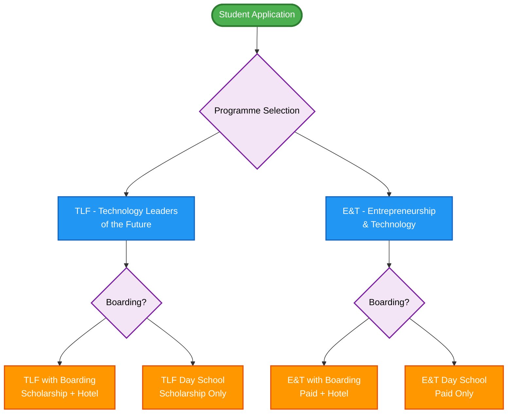
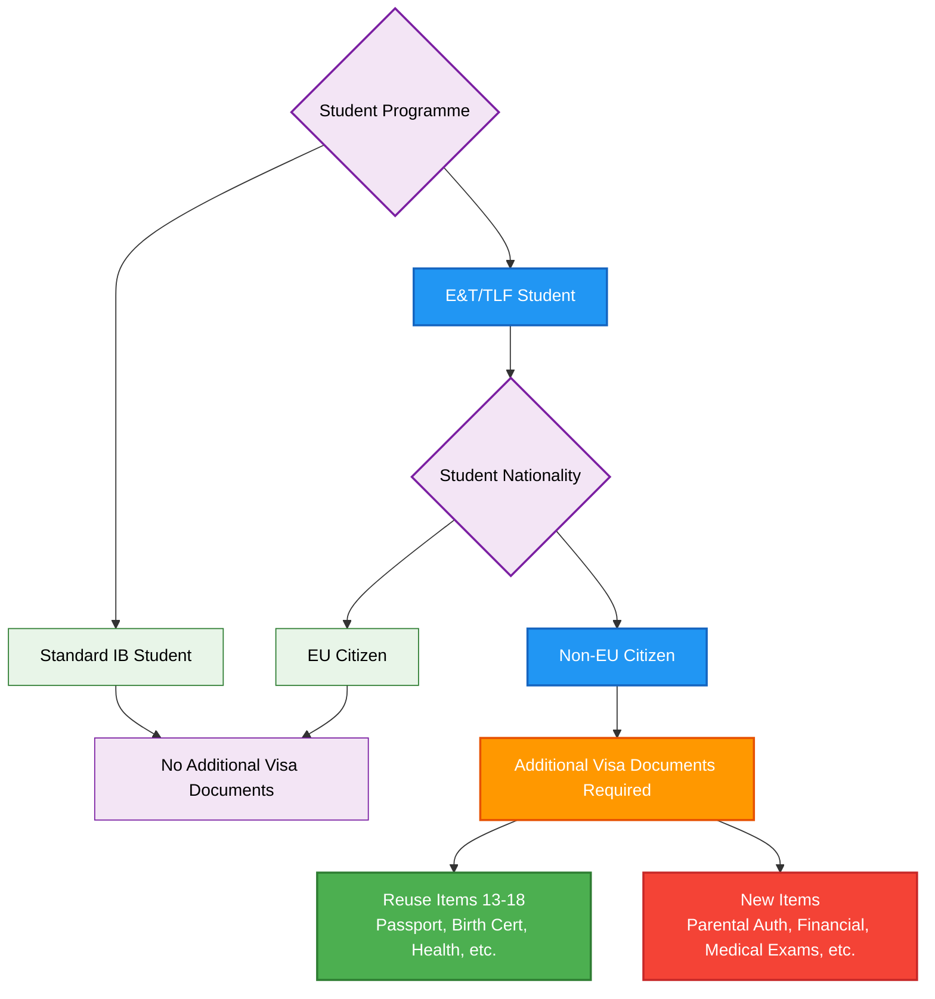
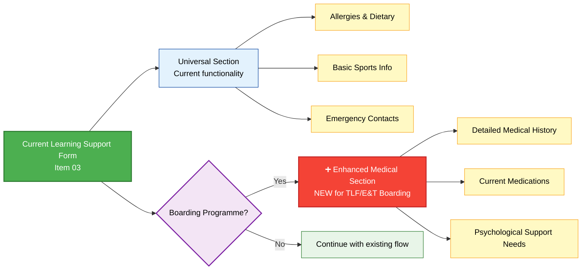

# Implementation Extensions - TLF & E&T Programme Enhancements

> **Navigation:** [Main Checklist](checklist.md) | [ROI Form](forms/roi.md) | [Learning Support](forms/ls.md) | [Swimming Form](forms/swimming.md) | [Physical Activity](forms/physical.md) | [Current Checklist Analysis](current_checklist_analysis.md) | [Extensions](extensions.md)

## Overview

Based on the comprehensive requirements from Ilya and the detailed analysis of the TLF and E&T programmes, this document outlines integration strategy for the new programmes with the existing OpenApply checklist system. **This document references and builds upon the [Current Checklist Analysis](current_checklist_analysis.md)** to show exactly which items are being reused vs. newly created.

---

## Reuse Strategy Summary

### **✅ Direct Reuse Items (15 items)**
Items from current checklist that can be used **without modification** for TLF/E&T:

| Current Item | Type | Reuse for TLF/E&T | Notes |
|--------------|------|-------------------|-------|
| **06. Receive Decision from Admission Team** | To Do | ✅ Direct reuse | Universal admission process |
| **09-12. E-Signature Workflow** | To Do | ✅ Direct reuse | Standard enrolment process |
| **13. Child's Birth Certificate** | Document | ✅ Direct reuse | Universal requirement |
| **14. Child's Passport or ID Card** | Document | ✅ Direct reuse | **Also satisfies visa passport requirement** |
| **15. Parents' Passports or ID Cards** | Document | ✅ Direct reuse | **Also satisfies visa passport requirement** |
| **16. Proof of Residence** | Document | ✅ Direct reuse | Universal requirement |
| **17. Child's Health Certificate** | Document | ✅ Direct reuse | **Also satisfies visa health requirement** |
| **18. Vaccination Certificate** | Document | ✅ Direct reuse | **Also satisfies visa health requirement** |
| **19. Medical Report** | Document | ✅ Direct reuse | Conditional on Special Ed Needs |
| **20. Student's Photo** | Document | ✅ Direct reuse | Universal requirement |
| **21. Receive Invoice** | To Do | ✅ Direct reuse | Universal administrative step |
| **22. Receive Onboarding Email** | To Do | ✅ Direct reuse | Universal administrative step |

### **🔄 Modified Reuse Items (6 items)**
Items that need **condition updates** to properly include TLF/E&T:

| Current Item | Type | Modification Required | Integration Strategy |
|--------------|------|----------------------|----------------------|
| **01. Registration of Interest** | Form | Replace with TLF/E&T ROI | **REPLACE** with enhanced ROI form |
| **02. Book School Tour** | Optional | Update exclusion conditions | **MODIFY** to include TLF/E&T or create variants |
| **03. Learning Support Form** | Form | Enhance with boarding logic | **REPLACE** with boarding-enhanced version |
| **05. Interview with IB Representative** | To Do | Include TLF/E&T conditions | **MODIFY** conditions to include programmes |
| **07. Enrolment Form (2024-2025)** | Form | Add TLF/E&T variants | **ENHANCE** with programme-specific forms |
| **08. Enrolment Form (2025-2026)** | Form | Remove TLF exclusion | **MODIFY** conditions to include TLF/E&T |

### **➕ New Items Required (8 items)**
Programme-specific items **not available** in current checklist:

| New Item | Type | Programme Scope | Implementation Notes |
|----------|------|-----------------|----------------------|
| **Swimming Permission Form** | Form | Boarding only | New boarding-specific form |
| **Physical Activity & Gym Consent** | Form | Boarding only | New boarding-specific form |
| **Two Personal References** | Document | TLF/E&T only | New document submission |
| **Video Introduction** | Document | TLF/E&T only | New media upload |
| **Proof of Achievements** | Document | TLF/E&T only | New document submission |
| **Portfolio with Projects** | Document | TLF/E&T only | New document submission |
| **Additional Visa Documents** | Document | Non-EU E&T/TLF only | See Visa Integration Strategy below |
| **Boarding Code of Conduct** | Form | Boarding only | Available July 1st |

### **🚫 Excluded Items (4 items)**
Items that **explicitly exclude** TLF/E&T and need condition updates:

| Current Item | Current Exclusion Logic | Required Fix |
|--------------|------------------------|--------------|
| **02. School Tour** | Excludes TLF & E&T | Update conditions to include or create variants |
| **03. Learning Support** | Excludes TLF | Remove TLF exclusion, enhance with boarding |
| **04. Aptitude Tests** | Excludes TLF | **Keep TLF exclusion** (scholarship doesn't require tests) |
| **08. Enrolment Form 2025-2026** | Excludes TLF | Remove TLF exclusion |

---

## Enhanced Programme Architecture

### Programme Variants

---

## Visa Documents Integration Strategy

### **Current Visa Document Coverage**
The existing checklist **already collects most visa requirements**:

| Visa Requirement | Current Checklist Item | Status |
|-------------------|------------------------|---------|
| **Student Passport** | ✅ Item 14: Child's Passport | **REUSE** - Already collected |
| **Parent Passport** | ✅ Item 15: Parents' Passports | **REUSE** - Already collected |
| **Birth Certificate** | ✅ Item 13: Child's Birth Certificate | **REUSE** - Already collected |
| **Health Certificate** | ✅ Item 17: Child's Health Certificate | **REUSE** - Already collected |
| **Vaccination Certificate** | ✅ Item 18: Vaccination Certificate | **REUSE** - Already collected |
| **Proof of Residence** | ✅ Item 16: Proof of Residence | **REUSE** - Already collected |

### **Additional Visa Documents Required**
Based on `docs_for_visa.txt`, the following items need **new checklist items**:

| Additional Visa Document | Implementation Strategy |
|--------------------------|-------------------------|
| **Parental Authorization Letter** | ➕ New document submission |
| **Financial Support Evidence** | ➕ New document submission |
| **Programme Certification Letter** | ➕ New document submission (school provides) |
| **Accommodation Certification** | ➕ New document submission (school provides) |
| **Criminal Background Check** | ➕ New document submission |
| **Medical Examinations** | ➕ New document submission (Hepatitis B&C, HIV/AIDS, Syphilis, TB) |
| **Health Insurance Certificate** | ➕ New document submission |

### **Conditional Visa Logic**

---

## Learning Support Form Integration

### **Current Item 03 Enhancement Strategy**

**Reuse Base**: Item 03 "Submit Form for Learning Support (IB)"
**Enhancement**: Add boarding-specific conditional sections

### **Integration Benefits**
- **Reuses existing form structure** and field validations
- **Maintains current workflow** for standard IB students
- **Adds boarding enhancements** only when needed
- **Single form** reduces user confusion

---

## Final Forms Enhancement Strategy

### **Boarding-Specific Enhancements to Existing Items**

**Reuse Base**: Items 23-25 (Field Trip, School Bus, Dismissal Permission)
**Enhancement**: Add boarding-specific conditional sections

| Current Item | Boarding Enhancement | Implementation |
|--------------|---------------------|----------------|
| **23. Field Trip Authorization** | ✅ Reuse + boarding provisions | Add boarding-specific emergency contact fields |
| **24. School Bus Consent** | ✅ Reuse + boarding variations | Add boarding student transport options |
| **25. Dismissal Permission** | ✅ Reuse + boarding protocols | Add boarding-specific dismissal procedures |

---

## Implementation Timeline

### **Phase 1: Reuse Existing Items (Immediate)**
- [x] Map existing reusable items (Items 06, 09-22)
- [x] Identify modification requirements (Items 01-03, 05, 07-08)
- [ ] Update conditional logic for modified items
- [ ] Test existing document collection workflow

### **Phase 2: Enhanced Forms (June 21st Target)**
- [ ] Enhance Learning Support form (Item 03) with boarding sections
- [ ] Create programme-specific enrolment forms (Items 07-08)
- [ ] Add new TLF/E&T specific document submissions
- [ ] Implement additional visa document items

### **Phase 3: Integration Testing (July 1st+)**
- [ ] Test complete TLF/E&T workflow end-to-end
- [ ] Validate reused items work correctly with new programmes
- [ ] Add boarding code of conduct integration
- [ ] Final boarding-specific form enhancements

---

## Risk Mitigation

### **Reuse Risks**
- **Conditional Logic Conflicts**: Existing exclusions may interfere with TLF/E&T
- **Document Format Assumptions**: Existing validations may not suit new programmes
- **Workflow Dependencies**: Changes to reused items may affect current students

### **Mitigation Strategies**
1. **Thorough Testing**: Test all reused items with TLF/E&T programme selections
2. **Parallel Workflows**: Maintain separate conditional paths where needed
3. **Rollback Capability**: Ensure changes to existing items don't break current functionality
4. **Documentation**: Clear mapping between old and new item relationships

---

## Next Steps

1. **Validate Reuse Strategy**: Confirm which existing items can be safely reused
2. **Update Conditional Logic**: Modify exclusion conditions for Items 02, 03, 05, 08
3. **Create New Items**: Implement the 8 new programme-specific items
4. **Test Integration**: Ensure reused items work correctly with new programmes
5. **Schedule Stakeholder Review**: Anna (Learning Support), Nicos (Visa), Head of Boarding

---

**References:**
- [Current Checklist Analysis](current_checklist_analysis.md) - Complete breakdown of existing 25 items
- [Main Checklist](checklist.md) - TLF/E&T programme flowchart
- [ROI Form](forms/roi.md) - Enhanced Registration of Interest form 