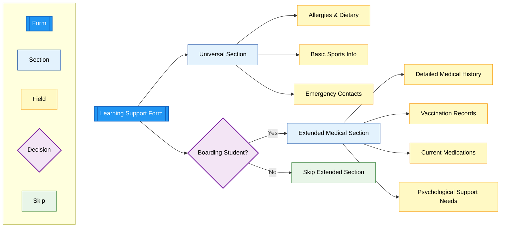

# Learning Support Form

> **Navigation:** [Main Checklist](../checklist.md) | [ROI Form](roi.md) | [Learning Support](ls.md) | [Swimming Form](swimming.md) | [Physical Activity](physical.md) | [Extensions](../extensions.md)

## Form Structure

### Universal Section (All Students)

#### Allergies & Dietary Requirements
**Required section** - Essential health and safety information
- **Food allergies**: Specific allergens and severity levels
- **Environmental allergies**: Pollen, dust, animals, etc.
- **Dietary restrictions**: Religious, medical, or personal preferences
- **Emergency medication**: EpiPen, inhalers, or other emergency treatments
- **Severity levels**: Mild, moderate, severe reactions

#### Basic Sports Information
**Required section** - Physical activity participation
- **Sports participation consent**: General authorization for school sports
- **Physical limitations**: Any restrictions on activities
- **Previous injuries**: Relevant medical history affecting sports
- **Preferred activities**: Student interests and preferences
- **Medical clearance**: Health status for physical activities

#### Emergency Contacts
**Required section** - Critical contact information
- **Primary emergency contact**: Parent/guardian with full details
- **Secondary emergency contact**: Alternative family member or friend
- **Medical emergency contacts**: Family doctor, specialist physicians
- **Authorization for medical treatment**: Consent for emergency care
- **Pickup authorization**: Who can collect the student

### Extended Medical Section (Boarding Students Only)

#### Detailed Medical History
**Required for boarding** - Comprehensive health background
- **Chronic conditions**: Diabetes, asthma, epilepsy, etc.
- **Mental health history**: Depression, anxiety, ADHD, etc.
- **Surgical history**: Previous operations and recovery details
- **Family medical history**: Genetic conditions and hereditary risks
- **Growth and development**: Any developmental concerns

#### Vaccination Records
**Required for boarding** - Complete immunization status
- **Standard vaccinations**: MMR, DPT, Polio, etc.
- **COVID-19 vaccination**: Current status and booster records
- **Travel vaccinations**: Hepatitis, Yellow Fever, etc.
- **Tuberculosis screening**: TB test results and dates
- **Medical exemptions**: Religious or medical vaccination waivers

#### Current Medications
**Required for boarding** - Medication management
- **Prescription medications**: Current drugs, dosages, and schedules
- **Over-the-counter medications**: Regular supplements or treatments
- **Administration instructions**: How and when to give medications
- **Storage requirements**: Refrigeration, controlled substances, etc.
- **Emergency medications**: EpiPen, rescue inhalers, seizure medications

#### Psychological Support Needs
**Required for boarding** - Mental health and behavioral support
- **Learning differences**: Dyslexia, ADHD, autism spectrum, etc.
- **Behavioral concerns**: Social anxiety, depression, anger management
- **Support strategies**: Effective coping mechanisms and interventions
- **Professional support**: Therapists, counselors, psychiatrists
- **Trigger situations**: Known stressors or problematic scenarios

## Implementation Notes

### Conditional Logic
- **Universal sections** appear for all TLF and E&T students
- **Extended medical section** only appears when boarding is selected
- **Integration with ROI**: Boarding status from Registration of Interest determines form complexity

### Medical Consultation Required
**Questions for Anna (Learning Support Coordinator):**
1. Exact field breakdown for basic vs. extended medical sections
2. Required vs. optional fields in each section
3. Integration with existing medical record requirements
4. Vaccination record format and validation requirements
5. Medication administration protocols for boarding students
6. Emergency response procedures and contact protocols

### Data Protection & Privacy
- **GDPR compliance** for sensitive medical information
- **Access controls** limiting who can view medical details
- **Secure storage** of vaccination records and medical history
- **Parent consent** for sharing medical information with relevant staff

### Integration Points
- **School nurse** receives relevant medical information
- **Boarding staff** get essential emergency and medication details
- **Sports coordinators** access physical activity restrictions
- **Academic support** team receives learning difference information