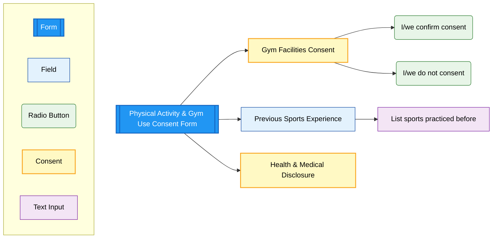

# Physical Activity & Gym Use Consent Form

> **Navigation:** [Main Checklist](../checklist.md) | [ROI Form](roi.md) | [Learning Support](ls.md) | [Swimming Form](swimming.md) | [Physical Activity](physical.md) | [Extensions](../extensions.md)

## Form Structure

### Gym Facilities Consent
**Required field** - Consent for gym facility access
- **I/we confirm consent**: Authorization for gym use
- **I/we do not consent**: Opt-out of gym activities
- Under boarding house staff supervision

### Previous Sports Experience
**Optional field** - Text input for sports background
- List sports child practiced before coming to Island School
- Helps staff understand student's athletic background
- Free text input field

### Health Confirmation & Medical Disclosure
**Required field** - Health status and medical information
- Confirmation that child is in good health
- Agreement to inform school of medical conditions
- Understanding of qualified staff supervision
- Acknowledgment of safe environment protocols

## Implementation Notes

### Boarding-Specific Form
- **Visible for**: Boarding students only
- **Condition**: Only appears if "Boarding Y/N" = Yes in ROI
- **Integration**: Part of boarding consent package

### Sports Program Integration
- **Background Information**: Collected for program planning
- **Medical Clearance**: Required for participation
- **Safety Protocols**: Staff supervision and safe environment
- **Risk Management**: Medical condition disclosure requirements

### Legal Compliance
- Digital signature capture required
- Health status confirmation
- Medical disclosure agreement
- Qualified supervision acknowledgment 