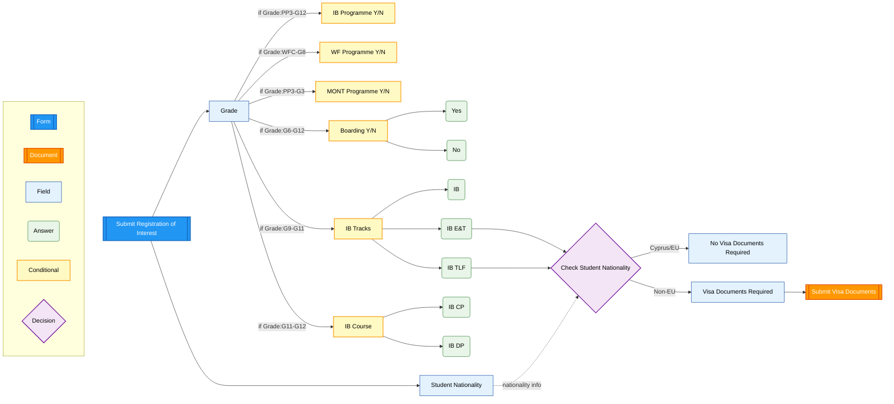

# Registration of Interest

> **Navigation:** [Main Checklist](../checklist.md) | [ROI Form](roi.md) | [Learning Support](ls.md) | [Swimming Form](swimming.md) | [Physical Activity](physical.md) | [Extensions](../extensions.md)

## Field Visibility Rules

### Grade Selection
**Always visible** - Determines which programme fields appear

### Citizenship
**Always visible** - Multiple choice field with all world countries
- **EU citizens:** No additional requirements
- **Non-EU citizens:** Visa documents required

### IB Programme Y/N
**Visible for grades:** PP3, PP4, PP5, G1, G2, G3, G4, G5, G6, G7, G8, G9, G10, G11, G12

### WF Programme Y/N  
**Visible for grades:** Waldorf Family Club/Pareklisia, PP3, PP4, PP5, G1, G2, G3, G4, G5, G6, G7, G8

### MONT Programme Y/N
**Visible for grades:** PP3, PP4, PP5, G1, G2, G3

### Boarding Y/N
**Visible for grades:** G6, G7, G8, G9, G10, G11, G12

### Visa Documents Required (collected in subsequent checklist items)
**Visible for:** Non-EU citizens only
**Condition:** Only if Citizenship ≠ EU country

### IB Tracks (Multiple Choice: IB / IB E&T / IB TLF)
**Visible for grades:** G9, G10, G11
**Condition:** Only if "IB Programme Y/N" = Yes

### IB Course (Multiple Choice: IB CP / IB DP)
**Visible for grades:** G11, G12  
**Condition:** Only if "IB Programme Y/N" = Yes

