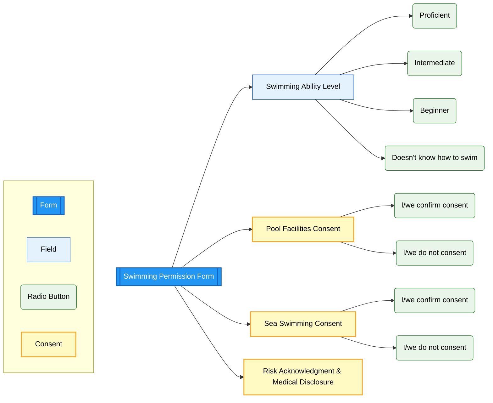

# Swimming Permission Form

> **Navigation:** [Main Checklist](../checklist.md) | [ROI Form](roi.md) | [Learning Support](ls.md) | [Swimming Form](swimming.md) | [Physical Activity](physical.md) | [Extensions](../extensions.md)

## Form Structure

### Swimming Ability Assessment
**Required field** - Multiple choice selection
- **Proficient**: Advanced swimming skills
- **Intermediate**: Basic swimming competency
- **Beginner**: Limited swimming ability
- **Doesn't know how to swim**: No swimming skills

### Pool Facilities Consent
**Required field** - Consent for swimming pool use
- Confirms parent authorization for pool activities
- Under boarding house staff supervision

### Sea Swimming Consent  
**Required field** - Consent for supervised sea activities
- Authorization for sea swimming under staff supervision
- Additional risk acknowledgment required

### Risk Acknowledgment
**Required field** - Legal disclaimer and medical disclosure
- Acknowledgment of inherent swimming risks
- Consent for participation under appropriate supervision
- Confirmation of medical condition disclosure
- Medical concerns affecting swimming safety

## Implementation Notes

### Boarding-Specific Form
- **Visible for**: Boarding students only
- **Condition**: Only appears if "Boarding Y/N" = Yes in ROI
- **Integration**: Part of boarding consent package

### Legal Compliance
- Digital signature capture required
- Risk acknowledgment with legal disclaimer
- Medical disclosure confirmation
- Parental consent documentation 